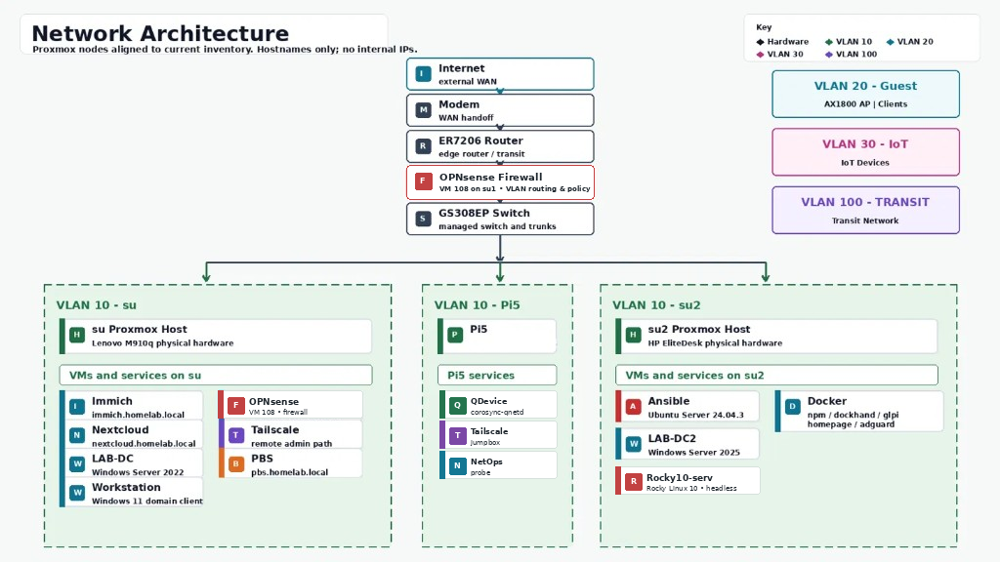

# Hi, I'm Lamar Scott (@lamsec94)

Systems and infrastructure professional building and operating a production-grade homelab
modeled after enterprise environments — used as both a learning platform and a portfolio
of real infrastructure work.

---

## 🏗️ What I Run

A two-node Proxmox cluster with 15+ VMs and LXC containers across segmented VLANs,
managed through OPNsense, documented end-to-end, and monitored through Wazuh SIEM.

| Layer | Stack |
|---|---|
| **Virtualization** | Proxmox VE — dual-node cluster (su1/su2), PBS backups |
| **Networking** | OPNsense firewall, 5 VLANs, GS308EP managed switch, Suricata IDS |
| **Identity** | Active Directory (WS2022 + WS2025 dual-DC) · FreeIPA (AlmaLinux) |
| **PKI** | Enterprise Root CA (ADCS) · wildcard `*.homelab.local` · 14 HTTPS services |
| **Monitoring** | Wazuh SIEM · OPNsense syslog + Suricata alerts · agent-based endpoint monitoring |
| **Automation** | Ansible · multi-host fleet · SSH pipelining · async patching (23 min → 2 min) |
| **DNS** | AdGuard Home · conditional forwarding to AD DNS · custom rewrites |
| **Access** | Nginx Proxy Manager · Tailscale subnet routing · GitHub remote |

---

## 🗺️ Lab Topology

---

## 📁 Repositories
| Repo | What's Inside |
|---|---|
| [homelab-runbooks](https://github.com/lamsec94/homelab-runbooks) | Operational runbooks — incident response, build guides, patching procedures |
| [homelab-network-documentation](https://github.com/lamsec94/homelab-network-documentation) | VLAN design, OPNsense config, switch assignments, network diagrams |
| [active-directory-lab](https://github.com/lamsec94/active-directory-lab) | AD OU design, GPOs, PKI/ADCS, dual-DC deployment, PowerShell provisioning |
| [wazuh-siem-deployment](https://github.com/lamsec94/wazuh-siem-deployment) | Wazuh deployment, agent config, dashboards, OPNsense log pipeline |
| [homelab-portfolio](https://github.com/lamsec94/homelab-portfolio) | Full architecture overview and lab documentation landing page |

---

## 🛠️ Skills
`Linux` `Windows Server` `Active Directory` `Proxmox VE` `OPNsense`
`Ansible` `Bash` `PowerShell` `Docker` `Wazuh` `FreeIPA`
`PKI / ADCS` `VLANs` `DNS` `Suricata` `Git` `ITIL`

---

## 📜 Certifications
- CompTIA A+
- ITIL Foundation
- Google IT Support
- CompTIA Network+ *(in progress)*

---

## 📫 Contact
- Email: scottlamar05@gmail.com
- LinkedIn: [linkedin.com/in/lamarscott](https://linkedin.com/in/lamarscott)
